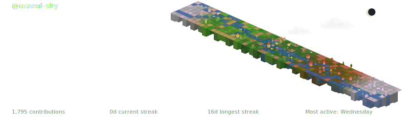

<div align="center">

# Maeul in the Sky (天空の村)

**GitHubコントリビューショングラフをアニメーション付きアイソメトリック地形に変換**

[](https://www.npmjs.com/package/maeul-in-the-sky)
[](https://www.npmjs.com/package/maeul-in-the-sky)
[](https://opensource.org/licenses/MIT)
[](https://nodejs.org/)
[](https://github.com/features/actions)
[](../README.md)
[](./README.ko.md)
[](./README.zh.md)

<br/>

<picture>
  <source media="(prefers-color-scheme: dark)" srcset="../.github/assets/preview-dark.svg">
  <source media="(prefers-color-scheme: light)" srcset="../.github/assets/preview-light.svg">
  
</picture>

*コントリビューショングラフが生きた村になります — 季節の変化、流れる川、動く雲とともに。*

</div>

## Maeul in the Skyとは？

Maeul in the Sky（天空の村）は、GitHubのコントリビューション履歴をアニメーション付きアイソメトリック地形SVGに変換します。*Maeul*（마을）は韓国語で「村」を意味します — コントリビューショングラフが空に浮かぶ生きた村になります。各日のコントリビューションレベルが地形ブロックになります — 活動なしは深い水、最大活動は高層ビル。4つの季節サイクルと48のシーズンアセット、バイオーム生成（川、池、森）、アンビエントアニメーションを含みます。

### 主な機能

- **アイソメトリック3D地形** — 100段階の高度システムがコントリビューションデータにマッピング
- **4つの季節サイクル** — 冬、春、夏、秋がスムーズに遷移し48のシーズンアセットを含む
- **バイオーム生成** — シードノイズによる手続き的な川、池、森クラスター生成
- **118種の地形アセット** — 木、建物、風車、雪だるま、桜など
- **アニメーションSVG** — 雲が流れ、水が輝き、旗がはためく — 純粋なSVG、JavaScriptなし
- **ダーク＆ライトモード** — 2つのバリアントを生成し`<picture>`タグで自動切替
- **半球サポート** — 北半球または南半球の季節マッピング
- **GitHub Action** — ワークフローに追加するだけで毎日自動更新

## クイックスタート

### GitHub Action（推奨）

`.github/workflows/maeul-sky.yml`にワークフローを追加：

```yaml
name: Generate Maeul in the Sky Terrain
on:
  schedule:
    - cron: '0 0 * * *'  # 毎日
  workflow_dispatch:

permissions:
  contents: write

jobs:
  generate:
    runs-on: ubuntu-latest
    steps:
      - uses: actions/checkout@v4

      - uses: t1seo/maeul-in-the-sky@v1
        with:
          github_token: ${{ secrets.GITHUB_TOKEN }}

      - uses: stefanzweifel/git-auto-commit-action@v5
        with:
          commit_message: 'chore: update maeul-in-the-sky terrain'
```

プロフィールREADMEに追加：

```markdown
<picture>
  <source media="(prefers-color-scheme: dark)" srcset="./maeul-in-the-sky-dark.svg">
  <source media="(prefers-color-scheme: light)" srcset="./maeul-in-the-sky-light.svg">
  
</picture>
```

### Action入力値

| 入力 | 説明 | デフォルト |
|------|------|------------|
| `github_token` | API接続用GitHubトークン | `${{ github.token }}` |
| `theme` | テーマ名 | `terrain` |
| `title` | カスタムタイトルテキスト | GitHubユーザー名 |
| `output_dir` | 出力ディレクトリ | `./` |
| `year` | 対象年 | 現在の年 |
| `hemisphere` | 季節マッピング（`north`または`south`） | `north` |
| `density` | 建物密度 1-10（高いほど低い活動でも建物が出現） | `5` |

### カスタマイズ例

```yaml
# 南半球（オーストラリア、ブラジルなど）
- uses: t1seo/maeul-in-the-sky@v1
  with:
    github_token: ${{ secrets.GITHUB_TOKEN }}
    hemisphere: south

# カスタムタイトル
- uses: t1seo/maeul-in-the-sky@v1
  with:
    github_token: ${{ secrets.GITHUB_TOKEN }}
    title: "My Coding Journey"

# 特定の年
- uses: t1seo/maeul-in-the-sky@v1
  with:
    github_token: ${{ secrets.GITHUB_TOKEN }}
    year: 2025

# 適度な活動でも建物が出現するように
- uses: t1seo/maeul-in-the-sky@v1
  with:
    github_token: ${{ secrets.GITHUB_TOKEN }}
    density: 8
```

## 地形はどのように作られますか？

GitHubコントリビューショングラフの各マスが1つの地形ブロックになります。その日のコミットが多いほど、より発展した地形が生まれます。

| 活動量 | 地形 | 説明 |
|:---:|:---:|:---|
| コミットなし | 🌊 海 | 海タイル — 空の海 |
| 少量コミット | 🏖️ 砂＆草原 | 平らな土地が現れる |
| 通常コミット | 🌲 森 | 木と植物が育つ |
| 平均以上 | 🌾 農場 | 畑、納屋、風車 |
| 活発な日 | 🏘️ 村 | 家と小さな建物 |
| 最高活動 | 🏙️ 都市 | 高い建物とタワー |

> **絶対値ではなく、自分基準の相対値です。** 普段1日2〜3回コミットする人なら、3回のコミットだけで村や都市レベルに到達します。1日20回コミットする人は約20回必要です。地形は*あなた自身のリズム*を反映します。

**地形を決める2つの要素：**

- **毎日コミットする** → 海が減り、マップ全体に陸地が現れる
- **1日に多くコミットする** → その日の土地が草原から森、建物にアップグレード

毎日コーディングする人は村が並ぶ緑豊かな島になります。数日に集中的にコーディングする人は海から高くそびえる都市が点在します。

### `density`とは？

地形レベルは**自分の活動に対する相対値**で計算されます — 最も活発だった日がピークとなり、他の日はそれに比例してスケーリングされます。そのため建物（村、都市）は最も活発な日にのみ出現し、「普通の」日は森や農場にとどまる傾向があります。

特にコミットパターンが不均一な場合にこの現象が顕著です。例えば、最も忙しい日に10コミットしたが普段は1-2コミットの場合、普段の日は森レベル（~30-45/99）程度にしかなりません — 建物はレベル79から出現します。`density`設定はこの基準を下げて、日常のコミットでも村が出現するようにします。

> **「文明ブースト」と考えてください。** 地形の高さや色は変わりません — 各ブロックに表示されるアセット（木 vs 家 vs タワー）のみが変わります。

**推奨設定：**

| コミットパターン | 推奨 `density` | 理由 |
|:---|:---:|:---|
| 毎日コンスタントに同量コミット | `5`（デフォルト） | ほとんどの日がピークに近く、建物が自然に出現 |
| 毎日コミットするが時々爆発的な日がある | `6`–`7` | 爆発的な日が基準を押し上げる — 普段の日にも建物が見えるように |
| 週2-3日、同量コミット | `7`–`8` | 活動日のレベルは高いがまばら — ブーストで村の範囲に到達 |
| 散発的にまとめてコミット | `8`–`9` | ピークと平均の差が大きい — 高いブーストで差を埋める |
| 始めたばかりやごくたまにコミット | `9`–`10` | 少ない活動でもやりがいを感じられるよう建物を最大化 |

`density`を`1`–`4`に設定すると逆の効果があります — 建物の出現基準が上がり、より多くの自然が見られます。地形が都市的すぎると感じたら、この設定を使ってください。

> **なぜこの設定があるのか：** Maeul in the Skyはコントリビューショングラフを楽しくすることが目標です。森から繁栄する村へ成長する地形を見ると、毎日コーディングしたいモチベーションが湧きます — `density`はコミットパターンが完璧に均一でなくても、その感覚を誰もが体験できるようにします。

## ライセンス

[MIT](../LICENSE) &copy; [t1seo](https://github.com/t1seo)
